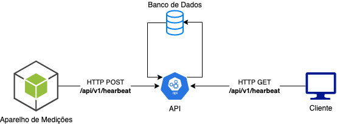

# hear-beat-monitor-plus

API responsável por gravar leitura de aparelho de batimentos cardíacos e prover analise atráves de endpoint público.

_Funcionalidades implementadas:_
- Criar Batimento Cardíaco.
- Lista análises de batimento cardíaco.

## 🔗 URL

| Environment   | URL                                                                       |
| -----------   | ------------------------------------------------------------------------- |
| Development   | <http://localhost:3333>         |

## Resources

### v1
 - Busca lista das 20 análises mais recentes: ***/api/v1/hearbeat/*** - GET
 - Criar leitura: ***/api/v1/hearbeat/*** - POST

## Informações para o desenvolvedor

### Stack

- [NodeJS](https://nodejs.org/en/)
- [Typescript](https://www.typescriptlang.org/)

### Frameworks

- [ExpressJS](https://expressjs.com/pt-br/)
- [Prisma](https://www.prisma.io/)
- [JestJS](https://jestjs.io/)
- [SuperTest](https://github.com/visionmedia/supertest#readme)

### Protocolos de Comunicação

- REST

### Como executar:

`yarn run migrate`

`yarn install`

`yarn dev`

### Arquitetura

